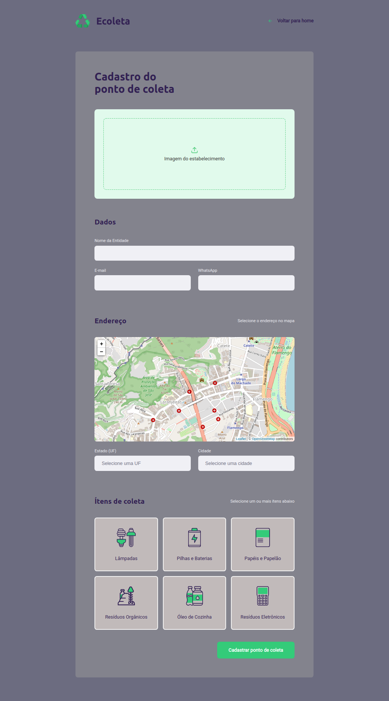
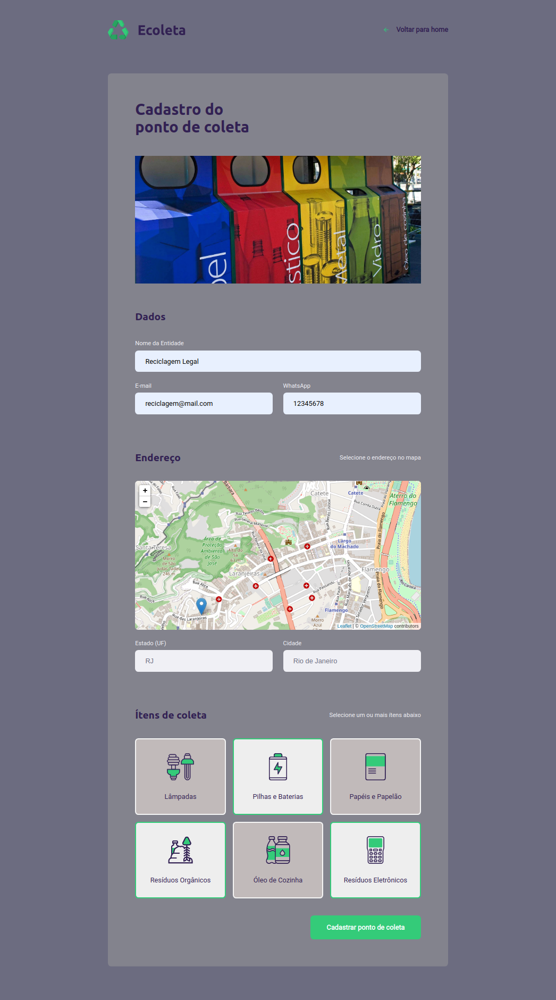
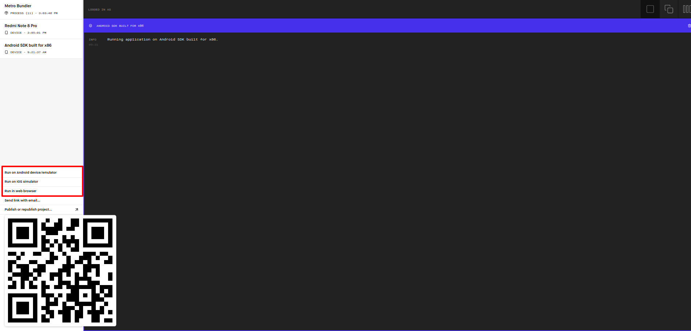
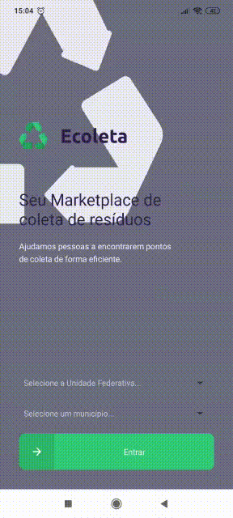

<p align="center">
  
</p>

<p align="center">
  
  
  
  
  
</p>

# Projeto

**Ecoleta**, desenvolvido durante a *Next Level Week*, é uma aplicação com o objetivo de facilitar a conexão entre entidades que coletam resíduos, tanto orgânicos quanto inorgânicos. A empresa coletora faz o cadastro na parte web e os usuários conseguem encontrá-las através do app usando filtros por UF/Estado/Item.


## 🎓 Server

### 🧭 Rodando o Backend

  ```bash
  # Clone este repositório
  $ git clone https://github.com/vitorsemidio-dev/ecoleta-nlw.git

  # Acesse a pasta do projeto
  $ cd ecoleta-nlw

  # Acesse para a pasta do server
  $ cd server

  # Instale as dependências
  $ npm install ou yarn

  # Faça a migração das tabelas do banco de dados
  $ npm run knex:migrate ou yarn knex:migrate

  # Semente para preencher o banco com dados iniciais
  $ npm run knex:seed ou yarn knex:seed

  # Crie .env
  $ touch .env #Após criar o arquivo, preencha os valores de HOST e PORT

  # Execute a aplicação em modo de desenvolvimento
  $ npm run dev ou yarn dev

  # O servidor inciará na porta e host informado no .env
  # Caso não informe, rodará no http://localhost:3333
  ```
### 🚀 Tecnologias usadas

- [Express](https://expressjs.com/pt-br/)
- [KnexJS](http://knexjs.org/)
- [SQLite3](https://www.sqlite.org/index.html)
- [Axios](https://github.com/axios/axios)
- [Multer](https://github.com/expressjs/multer)
- [Celebrate](https://github.com/arb/celebrate)

### 📸 Foto


---

## 💻 Web

### ✋🏻 Antes de rodar o FrontEnd
  - `Certifique-se de que o backend esteja rodando`


### 🧭 Rodando o FrontEnd

  ```bash
  # Clone este repositório
  $ git clone https://github.com/vitorsemidio-dev/ecoleta-nlw.git

  # Acesse a pasta do projeto
  $ cd ecoleta-nlw

  # Acesse para a pasta do server
  $ cd web

  # Instale as dependências
  $ npm install ou yarn

  # Execute a aplicação em modo de desenvolvimento
  $ npm start ou yarn start

  #A aplicação será aberta na porta:3000 - acesse http://localhost:3000
  ```
### 🚀 Tecnologias usadas

- [React Leaflet](https://react-leaflet.js.org/)
- [React Dropzone](https://react-dropzone.js.org/)

### 📸 Foto





---

## 📱 Mobile

### ✋🏻 Antes de rodar o Mobile
  - `Certifique-se de que o backend esteja rodando`
  - Baixe o Expo na sua loja de aplicativos do dispositivo. [Android](https://play.google.com/store/apps/details?id=host.exp.exponent) ou [iOS](https://apps.apple.com/br/app/expo-client/id982107779)
  - Ou deixe o emulador executando, caso não queira rodar em dispositivo físico

### 🧭 Rodando o Mobile

  ```bash
  # Clone este repositório
  $ git clone https://github.com/vitorsemidio-dev/ecoleta-nlw.git

  # Acesse a pasta do projeto
  $ cd ecoleta-nlw

  # Acesse para a pasta do server
  $ cd mobile

  # Instale as dependências
  $ npm install ou yarn

  # Execute a aplicação em modo de desenvolvimento
  $ npm start ou yarn start

  # A aplicação será aberta em http://localhost:19002/
  ```

### ✋🏻 Últimos passos

  - Caso tenha optado por rodar no dispositivo físico, abre o app do Expo e leia o QrCode
  - Caso tenha optado por rodar no emulador, clique em `Run on ... emulator`



### 📹 Video

<h1 align="center">
  
</h1>

### 🚀 Tecnologias usadas

- [Expo](https://expo.io/)
- [Expo MailComposer](https://docs.expo.io/versions/latest/sdk/mail-composer/)
- [React Native Picker Select](https://github.com/lawnstarter/react-native-picker-select)
