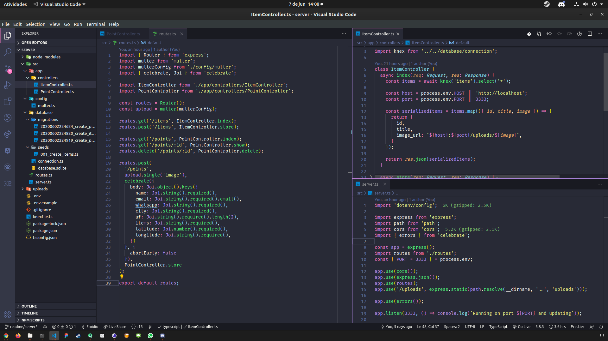

<p align="center">
  
</p>

<p align="center">
  
  
  
  
  
</p>

# Projeto

**Ecoleta**, desenvolvido durante a *Next Level Week*, é uma aplicação com o objetivo de facilitar a conexão entre entidades que coletam resíduos, tanto orgânicos quanto inorgânicos. A empresa coletora faz o cadastro na parte web e os usuários conseguem encontrá-las através do app usando filtros por UF/Estado/Item.


## 🎓 Server

### 🧭 Rodando o Backend

```bash
# Clone este repositório
$ git clone https://github.com/vitorsemidio-dev/ecoleta-nlw.git

# Acesse a pasta do projeto
$ cd ecoleta-nlw

# Acesse para a pasta do server
$ cd server

# Instale as dependências
$ npm install ou yarn add

# Faça a migração das tabelas do banco de dados
$ npm run knex:migrate ou yarn knex:migrate

# Semente para preencher o banco com dados iniciais
$ npm run knex:seed ou yarn knex:seed

# Crie .env
$ touch .env #Após criar o arquivo, preencha os valores de HOST e PORT

# Execute a aplicação em modo de desenvolvimento
$ npm run dev ou yarn dev

# O servidor inciará na porta e host informado no .env
# Caso não informe, rodará no http://localhost:3333
```
### 🚀 Tecnologias usadas

- [Express](https://expressjs.com/pt-br/)
- [KnexJS](http://knexjs.org/)
- [SQLite3](https://www.sqlite.org/index.html)
- [Axios](https://github.com/axios/axios)
- [Multer](https://github.com/expressjs/multer)
- [Celebrate](https://github.com/arb/celebrate)

### 📸 Foto



## Web


## Mobile